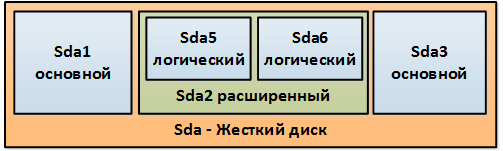
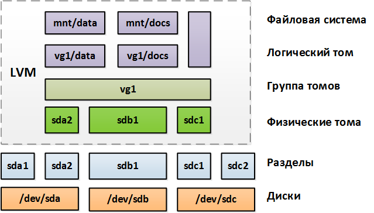

**102.1** Разбиение жесткого диска

Студент должен уметь разбивать жесткий диск на разделы согласно требованиям Linux.

**Изучаем:**

- расположение файловых систем на разных разделах;
- создание разделов на диске;
- требования к разделу /boot;
- основные возможности LVM.

**Термины и утилиты:**

- / (корень файловой системы)
- /var
- /home
- /boot
- раздел подкачки
- точки монтирования
- разделы

При включении ПК инициализируется ПО материнской платы, которое после всех проверок передает управление первым секторам основного жесткого диска. В этих секторах находятся файлы загрузчика – специального ПО, позволяющего загрузить ядро ОС в оперативную память.

Традиционно в Linux существует единственный корень всей файловой системы (верхняя точка дерева каталогов, обозначаемая символом **/** ), а все дополнительные разделы с различных жестких дисков (в том числе сетевые папки, флешки и т.д.) подключаются в ее пустые (можно монтировать и в каталоги с данными «поверх» них) каталоги (точки монтирования).

В случае наличия большого количества носителей (или исходя из требований системы) традиционно можно выделить отдельные разделы жесткого диска под следующие каталоги (в современном мире виртуалок отдельно монтируются директории с данными, а все остальное лежит на едином виртуальном диске):

- **/** – _корневая файловая система, самый большой раздел;_
- **/boot** – _загрузочный раздел;_
- **/home** – _домашние папки;_
- **/root** – _домашняя папка суперпользователя;_
- **/etc** – _конфигурация системы и ее компонентов;_
- **/opt** – _папка для ПО от третьих поставщиков;_
- **/var** – _часто изменяемые данные;_
- **/usr** – _все установленные пакеты программ, документация, исходный код ядра;_
- **/tmp** – _временные файлы;_
- **swap** – _раздел подкачки, никуда не монтируется._

Отдельно внимание уделяется каталогу **/boot**, часто монтируемому как отдельный раздел жесткого диска. На нем находятся следующие файлы:

- **abi-\*** - _функции и библиотеки, через которые к ядру обращаются приложения;_
- **config-\*** - _файл параметров, при которых создано текущее ядро;_
- **initrd.img-\*** - _образ стартовой корневой системы, загружающийся в ОЗУ;_
- **memtest\*** - _файлы ПО проверки ОЗУ;_
- **system.map-\*** - _карта аппаратных адресов системы;_
- **vmlinuz-\*** - _образ ядра системы._

На каждом жестком диске можно создать не более четырех разделов. Если вдруг потребуется больше разделов, то вместо основного раздела создается расширенный, который в свою очередь может содержать не более четырех логических разделов.

Жесткие диски именуются по порядку подключения: **sda, sdb, sdc** и т.д.

Разделы на каждом жестком диске нумеруются по порядку: **sda1, sda2** и т.д. При этом первые четыре цифры зарезервированы под основные и расширенные разделы, поэтому нумерация логических разделов начинается с пяти.

_Рисунок 1. Разделы жесткого диска_

Для создания, изменения, удаления и прочих действий с разделами используется утилита **fdisk** , которая в интерактивном режиме позволяет управлять разбиением жесткого диска _(будет подробно изучена в дальнейших уроках)_.

Для создания файловой системы на разделах используется утилита **mkfs** _(будет подробно изучена в дальнейших уроках)_.

Подключать созданные разделы можно как вручную при помощи команды **mount _имя_раздела_ _пустой_каталог_**, так и автоматически с использованием файла настроек **/etc/fstab** _(действия будут подробно изучены в дальнейших уроках)._

Раздел подкачки ( **swap** ) создается на жестком диске для временного хранения на нем данных, для которых не хватает места в оперативной памяти. Для форматирования раздела как раздела подкачки используется команда **mkswap** _(действия будут подробно изучены в дальнейших уроках)_.

В современных дистрибутивах Linux вместо классических разделов зачастую используются логические тома (**раздел** – часть диска, а **том** может располагаться на нескольких дисках одновременно), как более гибкий и надежный способ разбиения дискового пространства. Для этой цели используется **LVM** – менеджер логических томов.

При работе с LVM используются следующие понятия:

- **физический носитель ( /dev/sd\* )** – жесткий диск;
- **физический том (PV)** – носитель с некой системной инфой, которую понимает **LVM**;
- **физическое пространство (PE – physical extent)** – блоки дискового пространства;
- **группа томов (VG)** – набор **PE**;
- **логический том** – результирующее разбиение **VG**;

_Рисунок 2. LVM_

Для управления LVM доступен отдельный набор инструментов, например:

**pvdisplay** - _отобразить физические тома;_

**pvcreate /dev/sdb2** - _создать физический том **/dev/sdb2**;_

**vgcreate vg5 /dev/sdb1 /dev/sdb2** - _создать группу томов **vg5** из двух физических томов;_

**lvcreate -n lv2 -L 30G vg1** - _создать в группе **vg1** логический том **lv2** размером 30 Гб;_

**lvresize -L 40G vg1/lv2** - _изменить размер тома **lv2** в группе **vg1** до 40 Гб._

Подробнее про LVM: <https://help.ubuntu.ru/wiki/lvm>
